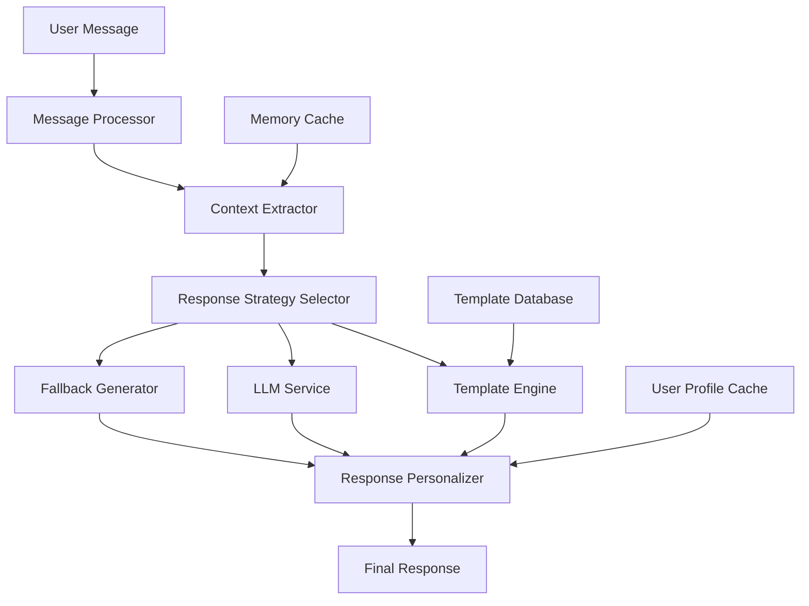

# Jumbo Conversation Enhancement Design

## Overview

This design document outlines a comprehensive approach to enhance Jumbo's conversational abilities while working within Render's free tier constraints (512MB RAM, limited CPU, cold starts). The solution prioritizes intelligent template-based responses with lightweight context integration, minimizing reliance on expensive LLM API calls.

## Architecture

### High-Level Architecture



### Core Components

1. **Enhanced Message Processor**: Lightweight analysis of user input
2. **Smart Context Extractor**: Efficient memory and context retrieval
3. **Intelligent Response Strategy Selector**: Chooses optimal response method
4. **Advanced Template Engine**: Context-aware template selection and variation
5. **Response Personalizer**: Adds user-specific touches to responses
6. **Memory-Efficient Caching**: Session-based caching to reduce database load

## Components and Interfaces

### 1. Enhanced Message Processor

```python
class EnhancedMessageProcessor:
    def analyze_message(self, message: str, user_context: dict) -> MessageAnalysis:
        """
        Lightweight message analysis including:
        - Emotion detection (keyword-based)
        - Intent classification (pattern matching)
        - Context extraction (simple NLP)
        - Memory triggers (relationship mentions)
        """
        
    def extract_entities(self, message: str) -> List[Entity]:
        """Extract names, emotions, topics using regex patterns"""
        
    def detect_conversation_type(self, message: str) -> ConversationType:
        """Classify as: greeting, emotional_support, memory_recall, casual_chat"""
```

### 2. Smart Context Extractor

```python
class SmartContextExtractor:
    def __init__(self):
        self.session_cache = {}  # In-memory cache for current session
        self.context_limit = 5   # Limit context to recent items
    
    def get_relevant_context(self, user_id: str, message_analysis: MessageAnalysis) -> UserContext:
        """
        Efficiently retrieve relevant context:
        - Check session cache first
        - Limited database queries (max 3 per request)
        - Prioritize recent and relevant memories
        """
        
    def cache_context(self, user_id: str, context: UserContext):
        """Cache context in memory for session duration"""
```

### 3. Intelligent Response Strategy Selector

```python
class ResponseStrategySelector:
    def select_strategy(self, message_analysis: MessageAnalysis, 
                       user_context: UserContext, 
                       system_load: SystemMetrics) -> ResponseStrategy:
        """
        Choose response method based on:
        - Message complexity
        - Available context
        - System resources
        - User preferences
        - API rate limits
        """
        
    def should_use_llm(self, analysis: MessageAnalysis) -> bool:
        """Determine if LLM is necessary (rare cases only)"""
```

### 4. Advanced Template Engine

```python
class AdvancedTemplateEngine:
    def __init__(self):
        self.templates = self._load_template_database()
        self.variation_tracker = {}  # Track used variations per user
    
    def select_template(self, strategy: ResponseStrategy, 
                       context: UserContext) -> Template:
        """
        Smart template selection based on:
        - Emotion category
        - Conversation type
        - User relationship stage
        - Previous template usage (avoid repetition)
        """
        
    def generate_variations(self, base_template: str, 
                          context: UserContext) -> List[str]:
        """Generate multiple variations of the same template"""
```

### 5. Response Personalizer

```python
class ResponsePersonalizer:
    def personalize_response(self, template_response: str, 
                           user_context: UserContext) -> str:
        """
        Add personal touches:
        - Insert user's preferred name
        - Reference recent memories
        - Adapt tone to user's emotional state
        - Include relevant follow-up questions
        """
        
    def add_contextual_elements(self, response: str, 
                              context: UserContext) -> str:
        """Add context-specific elements like memory references"""
```

## Data Models

### Enhanced Template Structure

```python
@dataclass
class ConversationTemplate:
    id: str
    category: str  # emotion, greeting, support, etc.
    emotion_tags: List[str]
    base_template: str
    variations: List[str]
    follow_up_questions: List[str]
    context_requirements: List[str]
    personality_tone: str
    usage_weight: float  # For rotation algorithm
```

### User Context Model

```python
@dataclass
class UserContext:
    user_id: str
    preferred_name: str
    recent_emotions: List[str]
    key_relationships: Dict[str, str]  # name -> relationship
    conversation_history: List[Message]  # Limited to last 5
    preferences: Dict[str, Any]
    session_metadata: Dict[str, Any]
```

### Message Analysis Model

```python
@dataclass
class MessageAnalysis:
    original_message: str
    detected_emotion: str
    emotion_confidence: float
    intent: ConversationIntent
    entities: List[Entity]
    context_triggers: List[str]
    complexity_score: float
```

## Enhanced Template Database Design

### Template Categories

1. **Emotional Support Templates**
   - Sadness: 15 variations with different approaches (validation, encouragement, questions)
   - Anxiety: 12 variations (grounding, reassurance, coping strategies)
   - Happiness: 10 variations (celebration, curiosity, sharing joy)
   - Anger: 8 variations (validation, de-escalation, understanding)

2. **Contextual Templates**
   - Memory recall: "I remember you mentioned [MEMORY]..."
   - Relationship references: "How is [FRIEND_NAME] doing?"
   - Follow-up questions: Based on previous conversation topics

3. **Conversation Flow Templates**
   - Transition phrases: "Speaking of [TOPIC]..."
   - Clarification requests: "Tell me more about..."
   - Empathy expressions: "That sounds [EMOTION_ADJECTIVE]..."

### Template Selection Algorithm

```python
def select_optimal_template(emotion: str, context: UserContext, 
                          usage_history: Dict) -> Template:
    """
    1. Filter templates by emotion category
    2. Check context requirements (memory, relationships)
    3. Apply anti-repetition algorithm
    4. Weight by user engagement history
    5. Select highest scoring template
    """
```

## Error Handling

### Graceful Degradation Strategy

1. **Primary**: Enhanced template-based responses (99% of cases)
2. **Secondary**: Basic template responses (if context unavailable)
3. **Fallback**: Simple empathetic responses (if all else fails)

### Memory and Performance Safeguards

```python
class ResourceManager:
    def monitor_memory_usage(self):
        """Monitor RAM usage, clear caches if needed"""
        
    def implement_circuit_breaker(self):
        """Disable expensive operations if system overloaded"""
        
    def optimize_database_queries(self):
        """Batch queries, use connection pooling"""
```

## Testing Strategy

### Performance Testing
- Memory usage under load (target: <400MB peak)
- Response time benchmarks (target: <500ms)
- Database query optimization (max 3 queries per request)
- Cache hit rate monitoring (target: >80%)

### Quality Testing
- Template variation effectiveness
- Context relevance scoring
- User engagement metrics
- Emotional appropriateness validation

### Load Testing
- Concurrent user simulation
- Cold start performance
- Database connection limits
- Memory leak detection

## Implementation Phases

### Phase 1: Core Template Engine (Week 1)
- Build advanced template database
- Implement template selection algorithm
- Create variation rotation system
- Basic context integration

### Phase 2: Context Enhancement (Week 2)
- Smart context extraction
- Session-based caching
- Memory integration improvements
- Response personalization

### Phase 3: Intelligence Layer (Week 3)
- Enhanced emotion detection
- Conversation flow optimization
- Anti-repetition algorithms
- Performance optimization

### Phase 4: Polish and Optimization (Week 4)
- Response quality refinement
- Performance tuning
- Error handling improvements
- User testing and feedback integration

## Monitoring and Analytics

### Key Metrics
- Response quality scores (user feedback)
- Template usage distribution
- Context hit rates
- System performance metrics
- User engagement improvements

### Success Criteria
- 50% reduction in repetitive responses
- 30% improvement in user engagement
- <500ms average response time
- >95% uptime on Render free tier
- Positive user feedback on conversation quality